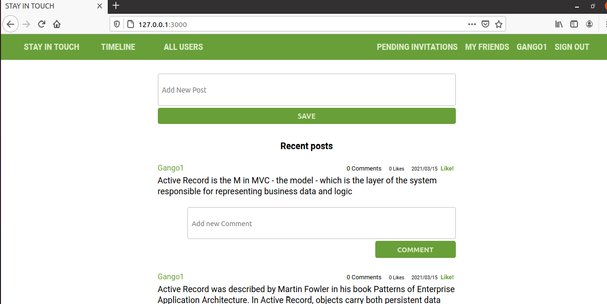

# STAY IN TOUCH

Stay In Touch is a revamped social media application created using Ruby on rails on top of a project that was already existing. This application allows friends to keep in touch by creating accounts, inviting other registered users to a friendship and communicate to each other through posts. Below is a screenshot of the home page of a signed in user.

## Home page of a logged in user.


## Built With
- HTML, CSS
- Ruby v2.7.0
- Ruby on Rails v5.2.4

## Live Demo


## Getting Started

To get a local copy up and running follow these simple example steps.

### Prerequisites

- Ruby: 2.7.0
- Rails: 5.2.4
- Postgres: >= 9.5

### Setup

Instal gems with:

```
bundle install
```

Setup database with:

```
   rails db:create
   rails db:migrate
```

### Run tests

```
    rpsec --format documentation
```

### Usage

Start server with:

```
    rails server
```

Open `http://localhost:3000/` in your browser.


## Author

GALIWANGO ANANIYA

- GitHub: [@gango-anan](https://github.com/gango-anan) 
- Twitter: [@gango_anan](https://twitter.com/gango_anan) 
- LinkedIn: [@galiwango-ananiya](https://www.linkedin.com/in/galiwango-ananiya-0800821b4/) 

## 🤝 Contributing

Contributions, issues, and feature requests are welcome!

Feel free to check the [issues page](https://github.com/gango-anan/ror-social-scaffold/issues).

## Show your support

Give a ⭐️ if you like this project!

## Acknowledgments

- Credit goes to TheOdinProject.


## 📝 License

This project is [MIT](https://github.com/gango-anan/ror-social-scaffold/blob/development/LICENSE) licensed.

